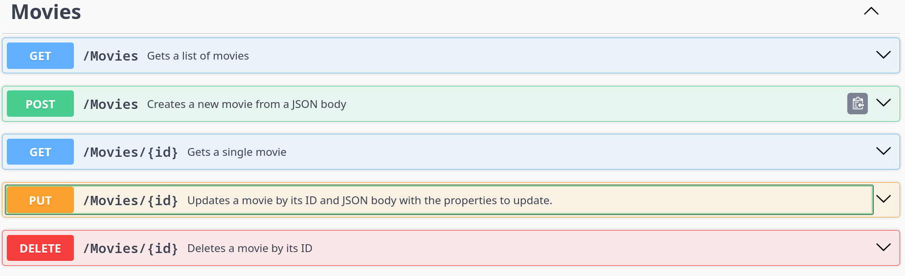

- [Project](#project)
    - [Resources](#project)
- [Template](#template)
- [Concepts](#concepts)
  - [Designing a controller](#designing-a-controller)
    - [ControllerBase class](#controllerbase-class)
    - [ApiController attribute](#apicontroller-attribute)
    - [Route attribute](#route-attribute)
    - [HTTP Methods](#http-methods)
    - [Return types](#return-types)
      - [Primitive data type](#primitive-data-type)
      - [ActionResult<T>](#actionresult)
      - [IActionResult](#iactionresult)
      - [Async/Await](#asyncawait)
  - [Adding Controller service](#adding-controller-service)
- [appsettings.json](#appsettingsjson)
- [Dependency Injection (injecting DbContext to the api)](#dependency-injection-injecting-dbcontext-to-the-api)
  - [Contructor](#contructor)
  - [AddDbContext](#adddbcontext)
- [Handling Migrations](#handling-migrations)
- [Swagger Documentation](#swagger-documentation)
    - [OpenAPI Documentation](#openapi-documentation)
    - [Adding comments](#adding-comments)
    - [Return types](#return-types)
    - [Remarks](#remarks)
    - [Response codes](#response-codes)
- [Technologies](#technologies)
- [Usage](#usage)
- [Author](#author)

# Project
In this little project we are implementing a ASP.NET Core Web Api with Controllers and connecting it to a minimalistic MySQL database to perform simple CRUD operations.

## Resources
- [Basics](https://learn.microsoft.com/en-us/aspnet/core/web-api/?view=aspnetcore-10.0)
- [Return types](https://learn.microsoft.com/en-us/aspnet/core/web-api/action-return-types?view=aspnetcore-10.0)
- [AddDbContext](https://learn.microsoft.com/en-us/ef/core/dbcontext-configuration/#dbcontextoptions)
- [Dependency Inject](https://learn.microsoft.com/en-us/ef/core/dbcontext-configuration/#dbcontext-in-dependency-injection-for-aspnet-core)

# Template
The template use for this project is `dotnet new web`, which is a total empty template, we are building this from scratch.

# Concepts
- Designing API's with controllers
- appsettings.json (for connection string configuration)
- Dependency Injection (injecting DbContext to the api)
- Migrations
- Swagger documenetation

## Designing a controller

### ControllerBase class
To get started with controllers we simply need to import the namespace `Microsoft.AspNetCore.Mvc`, in here we get access to `ControllersBase`, which is the base class we use to define a class as a Controller class.

### ApiController attribute
Once we got a class that inherits from `ControllerBase`, we can simply add the attribute `[ApiController]` to it, this class is now a controller.

### Route attribute
The simplest approach is to add a `[Route("[controller]")]` attribute to the class, this makes whatever the file name is (without the Controller) prefix the name of the route.

For example in my case I got `MoviesController.cs` as the file name, the route endpoint will then be `/movies` thanks to this attribute.

If we wwant to specify the route, we can also do so, for example `[Route("api/movies")]`, or `[Route("api/[controller]")]`.

### HTTP Methods
To enable a HTTP verb to a method we simply use the attributes `[HttpGet]`, `[HttpPost]` etc.

### Return types

#### Primitive data type
We can return whatever we want from an endpoint, `AspNetCore` will ensure its properly serialized to JSON. For example here im just returning a string to test the controller.

However, when returning a collection based type, it is recommended to use `IEnumerable<T>` for better performance. 

```c#
using Microsoft.AspNetCore.Mvc;

[ApiController] // Marks this class as a controller
[Route("[controller]")] // The name of this route is automatically MoviesController without Controller prefix
public class MoviesController : ControllerBase
{

    public string[] someData = new[] { "Yosmel", "test" };

    [HttpGet]
    public string[] GetMovies()
    {
        return someData.ToArray(); ;
    }
}
```

#### ActionResult<T>
The `ActionResult` class is a default implementation of the `IActionResult` interface. It is useful when we want to return meaningful HTTP responses (status codes) based on conditional checks. We might not care about it if we always return the same type of data and we dont need to handle errors with specific http status codes.

In the example above, Im always returning an array.

Now lets imagine we want to check if the array has items before returning data:

```c#
    [HttpGet]
    public ActionResult<string[]> GetMovies()
    {
        if (someData.Length < 1) return NotFound();

        return someData;
    }
```

Here we see that we can retuurn `NotFound()` which returns `404` or just the `data`, which under the hood is automatically wrapped under `Ok()` and returns `200`.

#### IActionResult
Its a flexible interface contract, that allows us to return multiple types of data, however we have to manually wrap the response object.

```c#
    [HttpGet]
    public IActionResult GetMovies()
    {
        if (someData.Length < 1) return NotFound();

        return Ok(someData);
    }
```

#### Async/Await
When working with async work, like databases, we want to to make this method `async` with `Task`.

## Adding Controller service
Once a controller has been setting up and we want to add it to our application, we simply put the following in `Program.cs`.

Before `app.build()`
```c#
builder.Services.AddControllers()
```

After `app.build`
```c#
app.MapControllerS();
```

# appsettings.json
`appsettings.json` is a configuration file that stores key-value pairs. It allows us to avoid hardcoding, and we can exclude this file entirely from our version control system through `.gitignore`.

# Dependency Injection (injecting DbContext to the api)
Instead of hardcoding the connection string in the `DbContext` class by overriding the `OnConfiguring` method like I have done earlier, we are going to implement `Dependency Injection`.

## Contructor
First we need to define the context class with a constructor that takes `DbContextoptions<>` parameter, this parameter carries all configurations set through `Dependency Injection` with the `AddDbContext` method. The documentation for this parameter is found [here](https://learn.microsoft.com/en-us/ef/core/dbcontext-configuration/#dbcontextoptions).

```c#
public MoviesContext(DbContextOptions<MoviesContext> options) : base(options) { }
```

## AddDbContext
Instead of adding configurations to instances of this class by overriding `OnConfiguring`, we add configurations to `DbContextOptions` through `AddDbContext` instead as its specifically designed for `Dependency Injection`.

```c#
// Gets the connection string from appsettings.json or throws an exception
var conString = builder.Configuration.GetConnectionString("Default") ?? throw new InvalidOperationException("Connection string is not defined");

// Injects the connection string to the DbContext class here
builder.Services.AddDbContext<MoviesContext>(options => options.UseMySQL(conString));
```

We can clearly see here that we are using `AddDbContext` with our specific `Context` class dervied from `DbContext`.

The documentation for Dependency Inject is AspNetCore can be found [here](https://learn.microsoft.com/en-us/ef/core/dbcontext-configuration/#dbcontext-in-dependency-injection-for-aspnet-core).

# Handling Migrations
- `dotnet ef migrations add InitialSeed` - Creates a new migration
- `dotnet ef migrations remove` - Removes a previous migration (Migrations work in last-in-first-out (LIFO) style, so only the last one can be removed after a rollback and so on)
- `dotnet ef migrations list` - List all current migrations
- `dotnet database update` - Uploads the migration changes to the database
- `dotnet ef database update 0` - Rolls back the migration to start, we can also specify a migrationname to rollback to instead.
- `dotnet database drop` - Deletes the entire database and all its tables ( full reset )

# Swagger Documentation
As we are using Swagger to documentate our API, there with the `Swashbuckle.AspNetCore` package.
- `Swagger` - Gives us a set of tools to configure and define the API documentation.
    - To use it we can add `builder.Services.AddSwaggerGen()` and`app.UseSwagger()` to `Program.cs`.
        - `SwaggerGen()` will automatically bring in the controller endpoints to swagger.
- `Swagger UI` - The tools that allows us to visualize our API, it provides us with an endpoint `/swagger`.
    - To use it we can add `app.UseSwaggerUI()` to `Program.cs`.

## OpenAPI documentation
OpenAPI is already built in the `AspNetCore` package, so we dont need to add anything extra.

However to further configure our Swagger documentation we can use the `OpenApiInfo` class to give our `SwaggerUI` some context.

```c#
builder.Services.AddSwaggerGen(options =>
{
    options.SwaggerDoc("v1", new OpenApiInfo
    {
        Version = "v1",
        Title = "Movie API",
        Description = "An ASP.NET Core API to manage CRUD operations on Movies"
    });

});
```

## XML Documentation
Swagger also allows us to provide XML comments from comments directly on the endpoints, this is a handy little feature that allows us to add some context to the endpoints.

To enable XML documentation we first must add this to the `.csproj` file under `<PropertyGroup>`.
```c#
    <GenerateDocumentationFile>true</GenerateDocumentationFile> // Generates <project>.xml, which is usually located in obj/Debug/net9.0/movies.xml
    <NoWarn>$(NoWarn);CS1591</NoWarn> // Shuts up the warning about missing XML comments 
```

This file is the one responsible for generating documentation out of comments like this
```c#
   /// <summary>
    /// Gets a list of movies
    /// </summary>
    /// <returns>List of movies</returns>
    [HttpGet]
    public async Task<ActionResult<IEnumerable<Movie>>> GetMovies()
    {
        var movies = await _ctx.Movies.ToListAsync();
        if (movies == null) return NotFound();

        return movies;
    }
```
To allow our application to bring in this `.xml` file to `Swagger` we must point to the path of this file then add that path to `.IncludeXmlComments()` method.

```c#
builder.Services.AddSwaggerGen(options =>
{
    options.SwaggerDoc("v1", new OpenApiInfo
    {
        Version = "v1",
        Title = "Movie API",
        Description = "An ASP.NET Core API to manage CRUD operations on Movies"
    });

    // Gets the name of the assembly and adds .xml to it    
    var xmlFile = $"{Assembly.GetExecutingAssembly().GetName().Name}.xml"; 

    // Resolves the full path, which is from root of the application and adds the <name>.xml file at the end
    // My current base directory path is /home/yosang/Downloads/movies/bin/Debug/net9.0/
    var xmlPath = Path.Combine(AppContext.BaseDirectory, xmlFile);

    // Adds the full path to the method
    // /home/yosang/Downloads/movies/bin/Debug/net9.0/movies.xml
    options.IncludeXmlComments(xmlPath);
});
```

## Adding comments
To add a comment we simply initiate with `///` and fill out.

```c#
    /// <summary>
    /// Gets a list of movies
    /// </summary>
    /// <returns>List of movies</returns>
```
Now we can see that SwaggerUI updates perfectly.



Each time the application builds, a new `.xml` is generated and brought into `Swagger`.

## Return types
To allow Swagger to show proper return types we can configure the `[ProducesResponseType]` attribute for each endpoint.

This allows Swagger to pull the response types and show them on the `SwaggerUI`.

We can pass the type of the entity we are returning, and the status code.

```c#
[ProducesResponseType(typeof(Movie), StatusCodes.Status200OK)]
[ProducesResponseType(StatusCodes.Status404NotFound)]
```

## Remarks
Adds some nice little examples to the Swagger documentation

```c#
    /// <remarks>
    /// Sample:
    /// {
    ///     "id": 1,
    ///     "Name": Titanic
    /// }
    /// </remarks>
```

## Response codes
Adds some context to the different response codes

```c#
    /// <response code="200">Returns a single movie</response>
    /// <response code="404">If no movie with the specified id was found</response>
```
# Technologies
- .NET 9
- Microsoft.EntityFrameworkCore
- Microsoft.EntityFramewworkCore.Design
- Swashbucke.AspNetCore

# Usage
- Clone the repo.
- Run it with `dotnet run`.
- Visit `/swagger` for the available endpoints. 

# Author
[Yosmel Chiang](https://github.com/yosang)